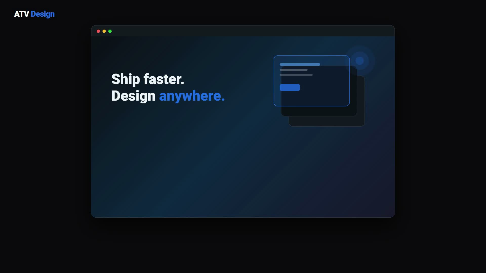

# ATV Design

[](./NOTICE)
[](https://www.electronjs.org/)
[](https://www.typescriptlang.org/)
[](https://nodejs.org/)
[](./CONTRIBUTING.md)

**ATV Design** is an open-source AI design agent for your desktop, built for GitHub Copilot. Turn natural-language prompts into production-ready design artifacts — HTML/JSX prototypes, PPTX slides, or PDFs — in seconds using your Copilot subscription via OAuth+PKCE. All credentials stay local, all processing on your machine. Also supports BYOK for Claude, GPT, Gemini, DeepSeek, Kimi, GLM, and Ollama.

A fast, privacy-first Figma alternative that runs on your laptop, powered by GitHub Copilot. Built on [OpenCoworkAI/open-codesign](https://github.com/OpenCoworkAI/open-codesign) (MIT); ships with premium skill bundles including **ui-ux-pro-max** and **emil-design-eng-inspired**.

See [NOTICE](./NOTICE) and [ATTRIBUTION.md](./ATTRIBUTION.md) for upstream attribution and license text.

---

## 🎬 Watch the 73-second demo

[](./assets/video/atv-design-demo.mp4)

> Prompt → SaaS landing hero, rendered in your Electron app — narrated walkthrough. Click the still to play locally (`assets/video/atv-design-demo.mp4`), or watch it embedded in the GitHub README on the web.

---

## ✨ Why ATV Design

- **GitHub Copilot native** — design with your Copilot subscription via OAuth+PKCE. Official SDK, documented flow, no reverse engineering.
- **Prompt-to-prototype in seconds** — describe your design idea; the AI agent generates interactive HTML/JSX, editable PPTX, or PDF exports instantly.
- **100% local-first, BYOK** — no accounts, no proxied APIs, no telemetry. Credentials live in plain-text config on your machine. Self-hosted or bring your own provider credentials.
- **Also supports BYOK for other providers** — Claude, GPT-4o, Gemini, DeepSeek, Kimi, GLM, Ollama. Switch providers in settings without losing work.
- **Design system first** — generates and refines `DESIGN.md` brand systems automatically. Consistent tokens across all designs; edit once, regenerate everywhere.
- **Extensible with skills** — ship with curated skill bundles (UI/UX pro patterns, animation design, and more). Load project-specific or user custom skills on demand.
- **Real workspace, real files** — designs live in your filesystem alongside `DESIGN.md`, assets, and exports. Edit with your favorite tools; re-run to regenerate.

---

## 🚀 Features

### GitHub Copilot Integration (Default)
- **Official Copilot SDK** — uses documented OAuth+PKCE flow. Use your Copilot subscription directly; no reverse-engineered tokens, no account creation.
- **Interactive sessions** — long-running design conversations with preview, tweak, and regenerate controls.
- **Structured input** — ask the agent questions; get answers with follow-up suggestions.
- **Live preview** — see HTML/JSX/CSS render in real-time with error reporting and metrics.

### Multi-Provider Support
- **Also supports BYOK providers**: Anthropic Claude, OpenAI (GPT-4o / GPT-4 Turbo), Google Gemini, DeepSeek, Kimi, GLM, Ollama (local), and OpenAI-compatible APIs.
- **Switch seamlessly** — pick providers in **Settings**; session history stays with the design workspace.

### Local-First & BYOK
- **No hosted backend** — zero dependency on external services. All processing on your machine or your chosen cloud provider.
- **Plain-text credentials** — API keys stored in `~/.config/atv-design/` as readable JSON. No account creation, sync, or vendor lock-in.

### Skills & Scaffolds
- **12 runtime-loaded skill entrypoints** — UI/UX pro patterns (colors, components, layouts), animation design guidance, and upstream carryovers.
- **ui-ux-pro-max bundle** — comprehensive design system patterns, component templates, and reference data.
- **emil-design-eng-inspired skill** — Emil Kowalski–inspired motion and design guidance.
- **Custom skills** — load project-local or user-level skills without modifying the app.

### Outputs
- **HTML/JSX prototypes** — interactive, styled, copy-paste ready.
- **PPTX slides** — auto-generated presentations with branding applied.
- **PDF exports** — high-fidelity static documents.
- **Design system artifacts** — `DESIGN.md` with extracted tokens (colors, fonts, spacing, scales).

### Design System Hub
- **Ingest brand data** — read from URLs, Git repos, or screenshots. Extract and unify color, typography, and spacing tokens.
- **Auto-refine** — regenerate designs with consistent tokens as your brand evolves.

---

## 🧠 Supported Providers & Models

| Provider | Models | Auth | Status |
|----------|--------|------|--------|
| **GitHub Copilot** ⭐ | Copilot Chat | OAuth + PKCE | ✓ Default |
| **Anthropic** | Claude 3.5 Sonnet, Opus, Haiku | API key | ✓ BYOK |
| **OpenAI** | GPT-4o, GPT-4 Turbo, GPT-4 | API key | ✓ BYOK |
| **Google Gemini** | Gemini 2.0, 1.5 Pro, 1.5 Flash | API key | ✓ BYOK |
| **DeepSeek** | DeepSeek Chat, R1 | API key | ✓ BYOK |
| **Kimi** | Kimi (all versions) | API key | ✓ BYOK |
| **GLM** | GLM-4, GLM-3 | API key | ✓ BYOK |
| **Ollama** | Any local Ollama model | Localhost | ✓ BYOK |
| **OpenAI-compatible** | Any OpenAI-compatible endpoint | Custom | ✓ BYOK |

---

## ⚡ Quick Start

### Prerequisites

- **Node.js 22 LTS** (see `.nvmrc`) and **pnpm 9.15+** (pinned in `package.json`).
- **Git**.
- *(Optional)* A GitHub Copilot subscription if you plan to use the default Copilot provider. BYOK providers work with their respective API keys.

### Run from Source

```bash
git clone https://github.com/All-The-Vibes/ATV-Design.git atv-design
cd atv-design
pnpm install
pnpm dev
```

On first launch:
1. Open **Settings** (gear icon).
2. Choose a provider and paste your API key (or leave blank for Ollama localhost).
3. Credentials stay local in `~/.config/atv-design/`.

For OAuth providers (GitHub Copilot), see [`docs/oauth-setup.md`](./docs/oauth-setup.md) for per-OS notes.

### Development Commands

```bash
pnpm test              # Run unit tests (Vitest) across all packages
pnpm typecheck         # TypeScript strict mode (all packages)
pnpm lint              # Biome format & lint
pnpm build             # Build all packages (electron-vite compile + package)
pnpm test:e2e          # Playwright end-to-end tests (builds first)
```

### Running the App

```bash
pnpm install           # first time only (downloads sqlite/electron prebuilds)
pnpm dev               # launches the Electron desktop app via electron-vite
```

On a headless Linux box (CI, containers, WSL without a display), wrap the GUI in
a virtual framebuffer:

```bash
xvfb-run -a --server-args="-screen 0 1440x900x24" pnpm dev
```

### Testing

**Unit tests (Vitest, ~2,100 tests across 10 packages):**

```bash
pnpm test                          # everything
pnpm --filter @atv-design/desktop test   # one package
```

**End-to-end (Playwright drives the real built Electron app):**

```bash
pnpm --filter @atv-design/desktop build         # E2E loads out/main/index.js
pnpm --filter @atv-design/desktop test:e2e      # or test:e2e:headed to watch
```

E2E specs live in `apps/desktop/e2e/`. They launch the actual main process via
Playwright's `_electron.launch` and seed a keyless Ollama config so the app boots
past onboarding without a network call (`e2e/fixtures/`). On headless Linux,
prefix with `xvfb-run -a`. Screenshot captures are written to
`apps/desktop/test-results/screenshots/`.

See [AGENTS.md](./AGENTS.md) for contributor setup and guidelines.

---

## 🧩 Skill Bundles

ATV Design loads skills with project > user > builtin priority:

1. **Built-in entrypoints** — 12 runtime-loaded skills at `packages/core/src/skills/builtin/*.md`:
   - 4 upstream carryovers
   - 7 `ui-ux-pro-max` ports (colors, layouts, components, grids, etc.)
   - `emil-design-eng-inspired` (motion and animation guidance)

2. **ui-ux-pro-max source bundle** — full reference data, templates, and assets at `skills/ui-ux-pro-max/`. MIT-licensed; compiled into runtime entrypoints.

3. **emil-design-eng-inspired source** — motion and design direction at `skills/emil-design-eng-inspired/`.

Custom skills can be added locally at `~/.config/atv-design/skills/` or `.codesign/skills/` in your workspace. See [`docs/skill-loader.md`](./docs/skill-loader.md) for the full contract.

---

## 🛠 Tech Stack

- **Runtime**: Electron + Node 22 LTS
- **UI Framework**: React 19 + Vite 6 + Tailwind v4 + CSS custom properties
- **Language**: TypeScript (strict mode, `verbatimModuleSyntax`)
- **State**: Zustand (no Redux, Recoil, or MobX)
- **Components**: Radix primitives + shadcn-style wrappers in `packages/ui`
- **Icons**: lucide-react
- **Build**: Turborepo + pnpm (no npm/yarn)
- **Linting & Formatting**: Biome
- **Testing**: Vitest (unit), Playwright (E2E)
- **Styling**: Tailwind v4 with CSS variables; transitions (no framer-motion)

---

## 📐 What Changed vs. Upstream

| Area | Upstream (`open-codesign`) | atv-design |
|------|---------------------------|-----------|
| **Branding** | open-codesign | atv-design |
| **Config dir** | `~/.config/open-codesign/` | `~/.config/atv-design/` |
| **OAuth Flow** | (upstream's) | Loopback HTTP `http://127.0.0.1:<random-port>/oauth-callback` |
| **Providers** | Anthropic, OpenAI, Gemini, DeepSeek, Kimi, GLM, Ollama, OpenAI-compatible | All above **+ GitHub Copilot SDK with PKCE (default)** |
| **Skills** | Upstream builtin set | 12 runtime-loaded (4 upstream + 7 `uipromax-*` + `emil-design-eng-inspired`) + preserved source bundles |
| **License Hygiene** | Upstream MIT | NOTICE with full upstream text + per-bundle READMEs |
| **CI** | Upstream | + `.github/workflows/forbidden-endpoints.yml` (blocks regressions to undocumented Copilot endpoints) |
| **Auth Architecture** | Per-provider defaults | Documented BYOK posture (see `docs/adr/0001-byok-oauth-posture.md`) |

The upstream **Electron + TypeScript + React + Vite + Tailwind + pnpm/Turbo stack is unchanged**. We do not fork or migrate the build system.

---

## 🎨 Terminal 42 × ATV Design

ATV Design pairs **Terminal 42's design-canvas UX and dark pro-tool visual
language** with **ATV Design's tested, secure, provider-rich backend**. The two
apps started from different places — Terminal 42 is a `copilot`-CLI-driven design
studio with a superb canvas; ATV Design is a client-side SDK app with a hardened,
BYOK-rich engine — so this is a **port behind a translation layer, not a frontend
swap**.

**What came from Terminal 42:**

- **Design-token inspector + viewport registry** — the two most valuable pieces
  of T42's `DesignCanvas`, extracted into tested units
  (`token-inspector.ts`, `viewport-profiles.ts`).
- **Dark pro-tool reskin** — T42's cool near-black canvas, three-step surface
  ladder, and sky-blue accent, mapped onto ATV's OKLCH token names in
  `packages/ui/src/tokens.css` (`.dark`). ATV's light theme (warm cream) is
  unchanged.

**What stayed ATV Design (the trunk):**

- Providers (GitHub Copilot SDK via OAuth+PKCE, Azure OpenAI/Foundry via Entra
  ID, and BYOK for Claude/GPT/Gemini/DeepSeek/Kimi/GLM/Ollama), agent
  orchestration, prompt intelligence, skills, SQLite+workspace storage, the
  security posture, and the full test suite.

**The seam** is `apps/desktop/src/renderer/src/lib/design-stream-adapter.ts` — a
stateful adapter that projects ATV's one-file-at-a-time `AgentStreamEvent`s into
the whole-`versions[]` callback contract T42's canvas expects (dedupe +
newest-wins ordering, 19 tests). Terminal 42's Copilot-CLI backend, PTY Brain,
and raw terminal were **not** taken.

See [`analysis/MERGE-ARCHITECTURE.md`](./analysis/MERGE-ARCHITECTURE.md) for the
contributor-facing walkthrough, [`analysis/T42-ON-ATV-ASSESSMENT.md`](./analysis/T42-ON-ATV-ASSESSMENT.md)
for an honest scope assessment, and [`ATTRIBUTION.md`](./ATTRIBUTION.md) for the
Terminal 42 license/attribution record.

---

## 🔐 Security

**atv-design uses only the documented Copilot SDK OAuth flow** ([GitHub docs](https://docs.github.com/en/copilot/how-tos/copilot-sdk/set-up-copilot-sdk/github-oauth)). The undocumented `copilot_internal` token exchange used by some third-party reverse-engineered clients is **forbidden** by our security checklist and blocked by CI at `.github/workflows/forbidden-endpoints.yml`.

See [`docs/security-checklist.md`](./docs/security-checklist.md) for the full audit rules.

**To report a security issue**, open a [GitHub Security Advisory](https://github.com/All-The-Vibes/ATV-Design/security/advisories).

---

## 🗺 Roadmap & Known Limitations (M1)

This fork's M1 milestone explicitly **does not ship**:

- ❌ Prebuilt binaries or tagged releases (`pnpm dev` only)
- ❌ npm publish or artifact hosting
- ❌ SaaS / hosted deployment
- ❌ shadcn/ui MCP integration
- ❌ `uipro-cli` shim

**M2 follow-ups** and the full issue catalog are documented in [`docs/known-issues.md`](./docs/known-issues.md).

---

## 📜 Attribution

This fork builds on the excellent work of:

- **[OpenCoworkAI/open-codesign](https://github.com/OpenCoworkAI/open-codesign)** — the base architecture; MIT-licensed.
- **[nextlevelbuilder/ui-ux-pro-max-skill](https://github.com/nextlevelbuilder/ui-ux-pro-max-skill)** — bundled as a verbatim port; MIT-licensed.
- **[Emil Kowalski](https://github.com/emilkowalski)** — inspired the `skills/emil-design-eng-inspired/` skill (paraphrase and original prose; no explicit LICENSE on upstream at fork time).

Full license text and per-bundle attribution in [`NOTICE`](./NOTICE) and [`ATTRIBUTION.md`](./ATTRIBUTION.md).

---

## 📄 License

atv-design is distributed under the **[MIT License](./NOTICE)**. The full text of every upstream license is preserved in [`NOTICE`](./NOTICE) per MIT's notice-preservation clause.

---

## 🤝 Contributing

Before opening a PR:

1. **Read the security checklist** if your change touches auth, OAuth, providers, or Copilot: [`docs/security-checklist.md`](./docs/security-checklist.md).
2. **Review attribution** if you add dependencies or ported code: [`ATTRIBUTION.md`](./ATTRIBUTION.md).
3. **Run the pre-commit checks**:
   ```bash
   pnpm typecheck && pnpm lint && pnpm test
   ```
   End-to-end tests are manual on M1; see [AGENTS.md](./AGENTS.md).

Roadmap and acceptance criteria are in `.omc/specs/` and `.omc/plans/`. Bug reports and feature requests go in [GitHub Issues](https://github.com/All-The-Vibes/ATV-Design/issues).

---

## 📖 About ATV Design

**ATV Design** is an open-source, local-first GitHub Copilot AI design agent that turns natural-language prompts into polished design artifacts. Whether you're prototyping UI components, generating presentation slides, or exporting brand-consistent PDFs, ATV Design runs entirely on your machine with GitHub Copilot (or your chosen BYOK provider) — no vendor lock-in, no telemetry, no accounts. It's a Figma alternative that respects your privacy and gives you full control. Built on proven Electron and React patterns; extensible via skills and DESIGN.md brand systems. Start designing in seconds with your Copilot subscription.

---

<!-- REPO_META
description: ATV Design — the GitHub Copilot-native AI design agent for your desktop. Prompt → prototype, slides, PDF with your Copilot subscription via OAuth+PKCE. Local-first, BYOK for other providers, MIT-licensed. Electron + TypeScript + React.
topics: github-copilot, copilot, copilot-sdk, copilot-extension, ai-design, design-agent, figma-alternative, local-first, byok, prompt-to-ui, design-to-code, desktop-app, electron, typescript, react, ui-generator, oauth-pkce, anthropic, openai
-->
